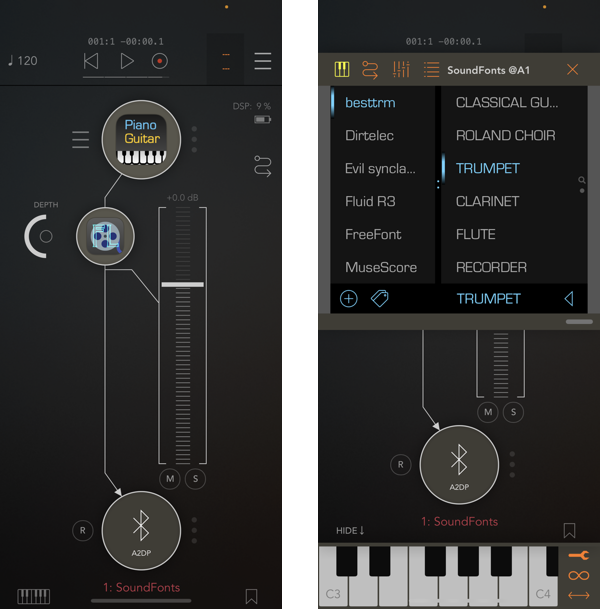

# SoundFonts App

🥳 [Check it out on Apple's App Store](https://apps.apple.com/us/app/soundfonts/id1453325077)

This is an iOS (and soon-to-be macOS!) application that acts as a polyphonic synthesizer. It uses an`AVAudioUnitSampler`
instance to generate the sounds for touched keys. The sounds that are avaiable come from _sound font_ files such
as those available [online](http://www.synthfont.com/links_to_soundfonts.html) for free (and of variable
quaility). There are four sound font files that are bundled with the application, and more can be added via the iCloud
integration.

> NOTE: AVAudioUnitSampler can and will crash if the SoundFont patch it is using for rendering does not conform
> to spec. Unfortunately, there is no way to insulate the app from this so it too will crash along with
> AVAudioUnitSampler.

I have also curated a small collection of SoundFont files that I found useful and/or interesting: [Sample
SoundFonts](https://keystrokecountdown.com/extras/SoundFonts/index.html). If you visit the site from your iOS
device and touch one of the links, you can add the fire directly to the SoundFonts application.

Here are some additional sites that have curated or custom SF2 files that should work with the application:

* [Soundfonts 4u](https://sites.google.com/site/soundfonts4u/)
* [Les Productions Zvon](https://lesproductionszvon.com/freesounds.htm)

## AUv3 App Extensions

Starting with v2.0, the application now contains an AUv3 app extension that can be loaded by other music
applications that support AUv3 audio units, such as
[GarageBand](https://apps.apple.com/us/app/garageband/id408709785) and
[AUM](https://apps.apple.com/app/id1055636344).

The app also includes two AUv3 effects: reverb, and delay. You can use them directly in the application, or add them to your signal processing
chain in an AUv3 host such as AUM.

I have additional AUv3 effects available:

- [Simply Flange](https://github.com/bradhowes/SimplyFlange) -- a simple flange effect
- [Simply Trremolo](https://github.com/bradhowes/SimplyTremolo) -- a simple tremolo effect
- [Simply Phaser](https://github.com/bradhowes/SimplyPhaser) -- a simple phaser effect

## User Interface

Here is what you can do with it:

* Switch between the patches view (image above) and a _favorites_ view (see below) by swiping left/right on the upper view with two touches.
* Double-tapping the patch name in the info bar above the keyboard will also switch the upper view
* You can touch the labels at either end of the black bar to change the range of the keyboard. In the image
  above, the first key is at "C4" and the last key shown is "G5". You can go as low as "C0" and as high as "C9".
* You can also swipe with a finger on back bar to change the keyboard range
* Swipe right on a patch name to make it a favorite (same to unfavorite). Favorited patches have a star next to
  their name.
* Add/Remove sound font files. In the "prsets view" press the "+" button to bring up a file picker. Locate a sound font file
  to add from a location on your device, or from your iCloud drive or Google Drive. Added files can be removed via the "-" button or a
  left-swipe on the sound font name.

## Notes on Adding From Cloud Drives

* __Files app (iCloud)__ — long-press on the file you want to import, select "Share" option. You should then be able to select "Copy to SoundFonts"
from the sharing sheet that appears.

* __Google Drive__ — touch the "•••" button next to the file name and then choose "Open in" from the list of available options. You
should then be able to select "Copy to SoundFonts" from the sharing sheet that appears.

* __Dropbox__ —  touch on the circled "•••" button below the file you want to import. Choose "Copy Link" option that appears. Select "Open In…"
and then "Copy to SoundFonts" from the sharing sheet that appears.

Unfortunately as far as I can tell there is no way to import directly from a web page with a native SF2 URL link. One must first have the file available on
a cloud drive before it can be imported via the iOS sharing sheet.

## Favorites

Double-tapping on the info bar switches between the fonts view and the the "favorites". This view shows all of the presets that have been 
"faved" or "starred". Pressing on a favorite will make its associated preset active. You can also reorder them by long-touching one and 
moving it to a new location among the others. There are various parameters one can adjust for a favorite that remain independent of the 
original preset it derived from. These include:

- the first note of the keyboard when the favorite becomes active
- a custom tuning to apply
- pitch bend range
- custom gain 
- custom stereo panning
- reverb and delay settings (app only)

Also, you can have more than one favorite for the same preset, each with its own collection of settings.

## Tags

You can create custom "tags" and assign them to sound fonts in your collection. Selecting a tag acts as a filter, only showing the sound fonts
are a member of the active tag. This can be an easy and effective way to organize your sound fonts files by categories or even by performance
or song.

## Settings

 

## Dependencies

There are no external dependencies. I wrote the code in Xcode 10.1, targeting iOS 12.1. The Xcode version has increased as has the Swift 
version, but it still works on iOS 12.1 devices.

The keys of the keyboard are painted by the code found in `KeyboardRender.swift`. This was generated by the
[PaintCode](https://www.paintcodeapp.com) application. The PaintCode file is `Keyboard.pcvd`, but it is not part
of the build process and PaintCode is not necessary to build.

## Embedded Sound Fonts

The repository comes with four SoundFont files, though the largest one -- `FluidR3_GM` -- is too large to store
natively on Github so it has been broken into three files: `FluidR3_GM.sf2.1`, `FluidR3_GM.sf2.2`, and
`FluidR3_GM.sf2.3`. I could move it to LFS but I do not want to mess with that. Instead, I have an Xcode build
phaase that should concatenate the individual files into one big one before packaging them all up into a 
resource in the SF2Files target.

# API Documentation

If you are interested, there is some [developer documentation](https://bradhowes.github.io/SoundFonts/)
available.
